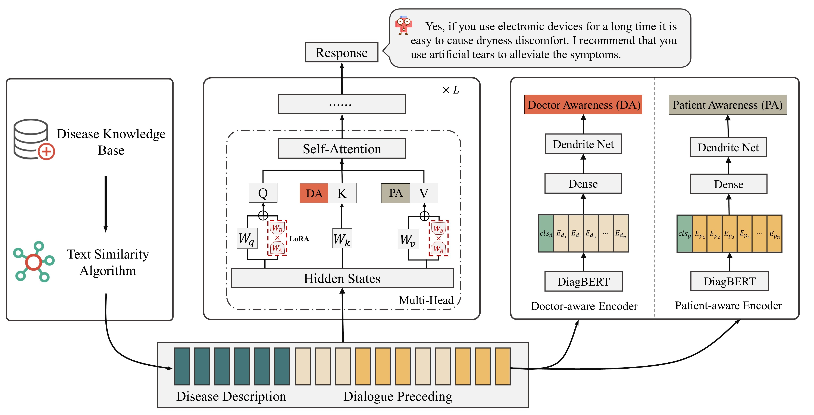

<div align="center">
<h1>
  EyeDoc
</h1>
<h2>ophthalmic consultation foundation model</h2>
</div>
<p align="center">
📝 <a href="https://arxiv.org/" target="_blank">Paper</a> • 🤗 <a href="https://huggingface.co/AI4Bread/Eyedoctor">Model</a> • 🤗 <a href="https://huggingface.co/datasets/AI4Bread/Eyedoctor" target="_blank">Datasets</a> • 🧩 <a href="https://github.com/sperfu/EyeDoc" target="_blank">Github</a>
</p>


## ✨ Recent News

- [6/21/2024] We have upgraded a web-based interface for users to use.
- [2/18/2024] The first version of the model was released.


## ⚡ Introduction

EyeDoc is the first open-source large language model focused on ophthalmic diseases. Our goal in developing EyeDoc is to create a more specialized large language model for the specific medical consultation scenario of ophthalmic diseases. Overall, compared to other medical large language models, our contributions are as follows:

1. We have collected over 40,000 single-turn QA dialogues and nearly 9,000 multi-turn dialogues related to ophthalmic diseases. To standardize the multi-turn dialogue data, we used **gpt-3.5-turbo** for data cleaning.

2. We have gathered knowledge information on 519 common ophthalmic diseases and constructed a specialized knowledge base for auxiliary diagnosis of ophthalmic diseases.

3. We have fully considered the knowledge differences and language characteristics of doctors and patients during consultations, and based on this, we separately represented the features for doctors and patients.




## 🤖 Installation

Use conda to create a new virtual environment with Python 3.9.0. Run the following command:

```
git clone https://github.com/sperfu/EyeDoc
conda create --name EyeDoc python=3.9.0
conda activate EyeDoc
pip install -r requirements.txt

<!-- ```
python==3.9.0
torch==2.1.2
transformers==4.35.2
peft==0.7.1
accelerate==0.25.0
bitsandbytes==0.42.0
rouge_chinese
nltk
``` -->

## 💭 Preparation

EyeDoc is fine-tuned based on a large language model. Before training, please configure or download the base large language model.

| Parameter Scale | Large Language Model Name                                     |
| ----------------| --------------------------------------------------------------|
| 1B              | [TinyLlama](https://huggingface.co/TinyLlama/TinyLlama-1.1B-Chat-v1.0) |
| 3B              | [bloom-zh-3b-chat](https://huggingface.co/ikala/bloom-zh-3b-chat) |
| 7B              | [Llama-2-7b-chat-hf](https://huggingface.co/meta-llama/Llama-2-7b-chat-hf) |

## ⚒️ Training

### 1. QA Training

```python
python A_train.py
# For more model hyperparameter adjustments, see the main function
```


###  2.  Multi-turn Training

```python
python A_train_doc_specific.py
# For more model hyperparameter adjustments, see the main function
```

##  🧐 Evaluation

```python
python A_evaluate.py
# For more model hyperparameter adjustments, see the main function
```

## 🚀 Generate

```
python A_generate.py	# # Model response generation
python A_Flask_web.py	# Model API interface call
```

## 🌐 Deployment

To deploy the EyeDoc model using Streamlit, follow these steps:

### 1. Install the required environment

First, ensure you have Python installed (preferably Python 3.9). Then, install Streamlit and other necessary packages:

```bash
pip install streamlit
pip install -r requirements.txt  # Ensure all dependencies listed in the requirements file are installed 
```

### 2. Start the Streamlit service

Run the Streamlit application using the following command:

```bash
streamlit run st_chat_login.py
```

This will start the Streamlit service, and you can access the web interface through the provided local URL (e.g., http://localhost:8501).