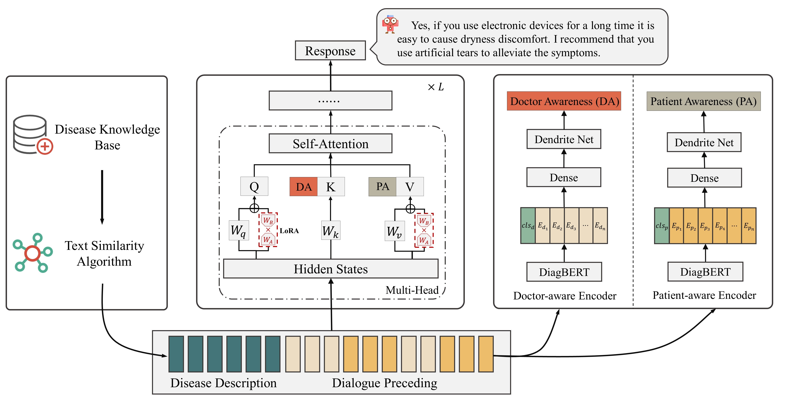

<div align="center">
<h1>
  EyeDoc
</h1>
<h2>ophthalmic consultation foundation model</h2>
</div>
<p align="center">
📝 <a href="https://arxiv.org/" target="_blank">Paper</a> • 🤗 <a href="https://huggingface.co/" target="_blank">Hugging Face</a> • 🧩 <a href="https://github.com/sperfu/EyeDoc" target="_blank">Github</a>
</p>


## ✨ 最新消息

- [2/18/2024] 模型首个版本发布。

## ⚡ 介绍

EyeDoc是首个开源的专注于眼部疾病的大语言模型，我们开发EyeDoc的目的是为眼部疾病这一具体的医疗咨询场景构建一个更专业的大语言模型。总的来说，相较于其它医疗大模型，我们的贡献在于以下几点：

1. 我们收集了4W余条针对眼部疾病的QA单轮次对话和近9,000条针对眼部疾病的多轮次对话。为了规范多轮次对话数据，我们利用 **gpt-3.5-turbo** 逐一进行了数据清洗工作。

2. 我们收集了519种常见眼部疾病知识信息，并构建了眼部疾病专有知识库以进行眼部疾病的辅助诊断。

3. 我们充分考虑了问诊过程中医生和病人两种角色的知识差异和语言特点，并以此为依据分别对医生和病人进行特征表示。




## 🤖 安装

```
python==3.9.0
torch==2.1.2
transformers==4.35.2
peft==0.7.1
accelerate==0.25.0
bitsandbytes==0.42.0
rouge_chinese
nltk
```

## 💭 准备

EyeDoc基于大语言模型微调而来，在训练之前请先配置或下载大语言模型基座。

| 参数规模 | 大语言模型名称                                               |
| -------- | ------------------------------------------------------------ |
| 1B       | [TinyLlama](https://huggingface.co/TinyLlama/TinyLlama-1.1B-Chat-v1.0) |
| 3B       | [bloom-zh-3b-chat](https://huggingface.co/ikala/bloom-zh-3b-chat) |
| 7B       | [Llama-2-7b-chat-hf](https://huggingface.co/meta-llama/Llama-2-7b-chat-hf) |

## ⚒️ 训练

###  1. QA训练

```python
python A_train.py
# 更多模型超参数调整见main函数内
```


###  2.  多轮次训练

```python
python A_train_doc_specific.py
# 更多模型超参数调整见main函数内
```

##  🧐 验证

```python
python A_evaluate.py
# 更多模型超参数调整见main函数内
```

## 🚀 生成

```
python A_generate.py	# 模型响应生成
python A_Flask_web.py	# 模型api接口调用
```

